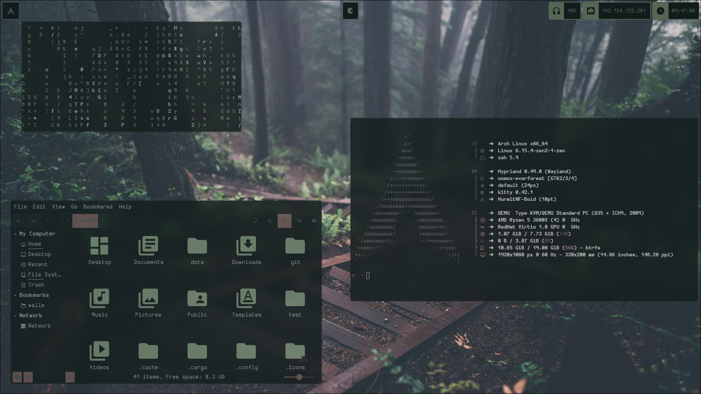

Installation:

1. git clone https://github.com/Riezz0/everforest.git /home/$USER/dots/

2. run setup.sh

3. Ensure you type "exit" once oh-my-zsh has installed so that the remainder of the installation may continue

4. Enjoy !!!!

NB:: This is still a W.I.P XD
