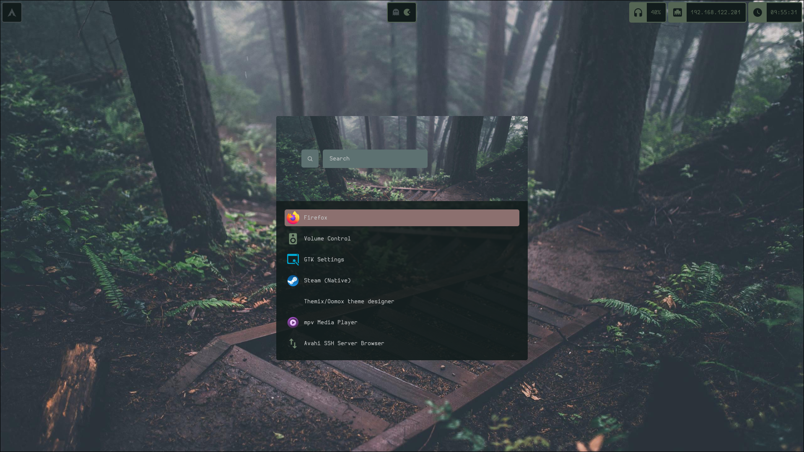

Installation:

1. Clone the repo: 
```bash
git clone https://github.com/Riezz0/everforest.git /home/$USER/dots/
```
2. Change executeable permissions
```
chmod +x /home/$USER/dots/setup.sh
```

3. Run the setup - Ensure you are in the /home/$USER/dots director
```bash
cd /home/$USER/dots/
```

4. Ensure you type "exit" once oh-my-zsh has installed so that the remainder of the installation may continue

5. Enjoy !!!!

NB:: This is still a W.I.P XD
